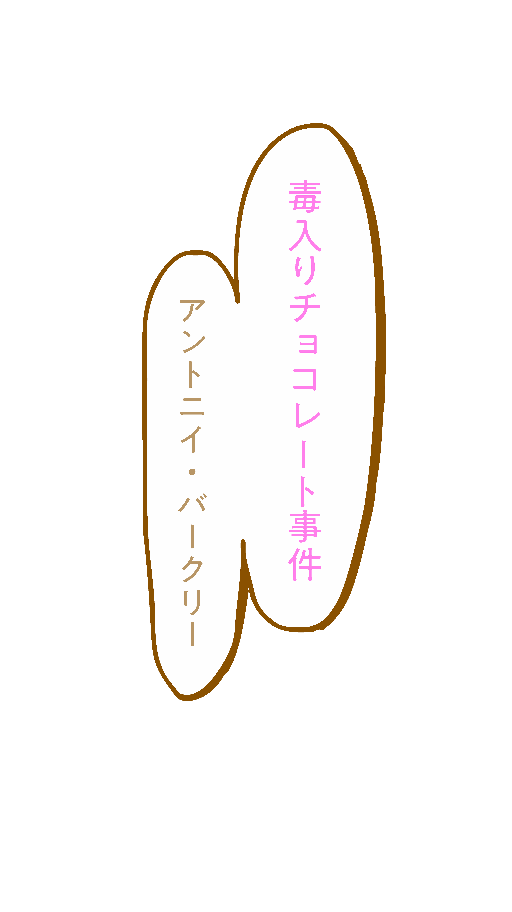

<!DOCTYPE html>
<html lang="ja">
<head>
<meta charset="UTF-8">
<meta name="viewport" content="width=device-width, initial-scale=1.0">
<title>Book Relay</title>
<link rel="stylesheet" href="style.css">
</head>
<body>

<!-- 1. タイトルセクション -->
<section id="titleSection" class="title-section">
    
</section>

<!-- 2. 動画セクション -->
<section id="videoSection" class="video-section">
    <video id="bgVideo" src="video2.mp4" autoplay muted playsinline loop></video>

    

</section>

<!-- 3. Sticky セクション（namae） -->
<section class="sticky-section" style="background-image: url('bg_main2.png')">
    

        
    

</section>

<!-- 4. Sticky セクション（arasuji） -->
<section class="sticky-section" style="background-image: url('bg_main2.png')">
    

        
    

</section>

</body>
</html>
